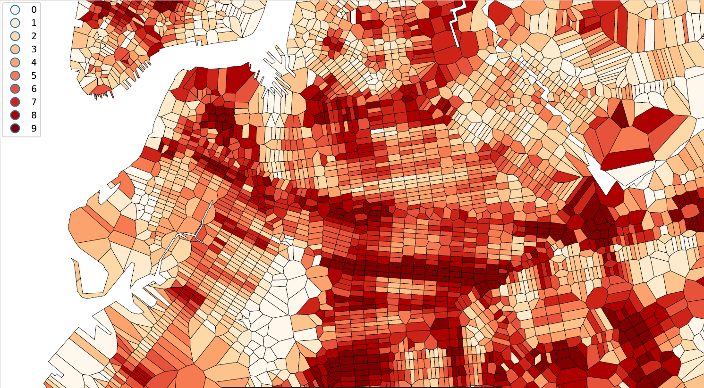

<!-- $theme: default -->

<!-- page_number: true -->

<!-- footer:  2019 Pennsylvania Economic Association Annual Conference May 31 2019 -->

# An Evaluation of the Impact of Leading Pedestrian Interval Signals in NYC

### Jeremy J. Sze
Hunter College, The City University of New York

[Jeremy.Sze@outlook.com](mailto:Jeremy.Sze@outlook.com)

[https://jeremysze.github.io](https://jeremysze.github.io)

---
# 1. Introduction

---

 Source: https://www.flickr.com/photos/romankphoto/

---
## Leading Pedestrian Interval Signals (LPIs)

 Source: [https://nacto.org/publication/urban-street-design-guide/intersection-design-elements/traffic-signals/leading-pedestrian-interval/](https://nacto.org/publication/urban-street-design-guide/intersection-design-elements/traffic-signals/leading-pedestrian-interval/)

---

---
## NYPD Motor Vehicle Collisions
* From July 2012 to September 2018
* Approximately 1.35 million collisions were recorded

Includes: 
* collision outcomes, coordinates, streets, borough, zip code, time, vehicle type, contributing factors

Stratified:
* 11.00 p.m. to 4.59 a.m.
* 5.00 a.m. to 10.59 p.m.

---

---

---

---

---

---

---

---

---
## Hypothesis

The introduction of LPIs reduced collisions and injuries

---
  # 2. Challenges and Solution

---
## Selective implementation

---
## Phased introduction

---
## Phased introduction

---
## Phased introduction

---
## Unobserved heterogeneity

---
## Spatial autocorrelation

---
## Spatial autocorrelation

---
### General Binary treatment Difference-in-difference model

* Simplifying from 25 quarters, we can think of it as there being 3 different groups
* untreated group $U$
* early treatment group $k$ that receives treatment at $t^*_k$
* late treatment group $l$ that receives treatment at $t^*_l$

---

### General Binary treatment Difference-in-difference model

---
## Assumptions
* Unmeasured determinants of the outcomes were time invariant or group invariant
* Common trends assumption
* Timing of the treatment implementation must be statistically independent of the potential outcomes distributions, conditional on the group-and time-fixed effects

---
# 3. Results
---
## Model Specifications and controls
* Indicator for when intersections received LPIs intervention
* Indicator for when Bike route was built
* Indicator for when Street Improvement was implemented
* Indicator for when Left Turn intervention was implemented
* School Zone trends
* Senior Zone trends
* Priority Intersections trends
* Time effects
* Intersection fixed effects

---

## NYC Fixed effects DiD (Pooled)

---
## NYC Fixed effects DiD (Pooled)

---

## NYC Fixed Effects DiD (Late Night)

---

## NYC Fixed Effects DiD (Non-late night)

---
## Spatial Lagged Overall Impact Fixed Effects DiD (Manhattan)

---
## Spatial Lagged Overall Impact Fixed Effects DiD (Manhattan)

---
## Questions? 
### Thank you!
[Jeremy.Sze@outlook.com](mailto:Jeremy.Sze@outlook.com)

[https://jeremysze.github.io](https://jeremysze.github.io)